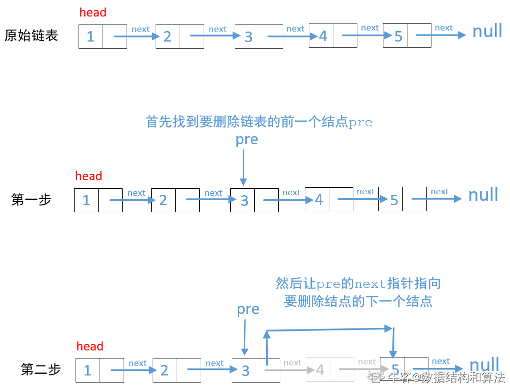

1，非递归解决

```java
    public ListNode removeNthFromEnd(ListNode head, int n) {
        ListNode pre = head;
        int last = length(head) - n;
        //如果last等于0表示删除的是头结点
        if (last == 0)
            return head.next;
        //这里首先要找到要删除链表的前一个结点
        for (int i = 0; i < last - 1; i++) {
            pre = pre.next;
        }
        //然后让前一个结点的next指向要删除节点的next
        pre.next = pre.next.next;
        return head;
    }

    //求链表的长度
    private int length(ListNode head) {
        int len = 0;
        while (head != null) {
            len++;
            head = head.next;
        }
        return len;
    }
```

2.双指针求解
```java
public ListNode removeNthFromEnd(ListNode head, int n) {
    ListNode fast = head;
    ListNode slow = head;
    //fast移n步，
    for (int i = 0; i < n; i++) {
        fast = fast.next;
    }
    //如果fast为空，表示删除的是头结点
    if (fast == null)
        return head.next;

    while (fast.next != null) {
        fast = fast.next;
        slow = slow.next;
    }
    //这里最终slow不是倒数第n个节点，他是倒数第n+1个节点，
    //他的下一个结点是倒数第n个节点,所以删除的是他的下一个结点
    slow.next = slow.next.next;
    return head;
}
```
3，递归解决
```java
    public ListNode removeNthFromEnd(ListNode head, int n) {
        int pos = length(head, n);
        // 说明删除的是头节点
        if (pos == n)
            return head.next;
        return head;
    }

    // 获取节点所在位置，逆序
    public int length(ListNode node, int n) {
        if (node == null)
            return 0;
        int pos = length(node.next, n) + 1;
        //获取要删除链表的前一个结点，就可以完成链表的删除
        if (pos == n + 1)
            node.next = node.next.next;
        return pos;
    }
```