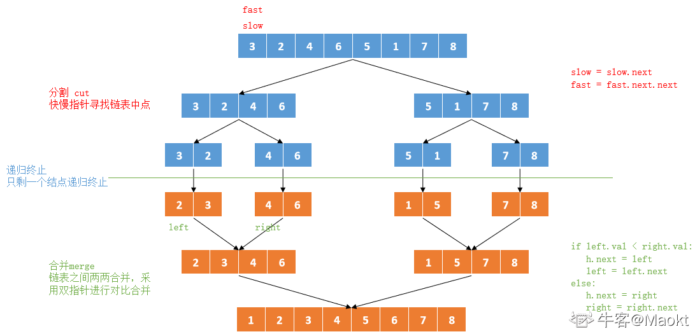

算法思想一：辅助数组
主要通过辅助数组实现链表的排序
1、遍历链表并将链表结点存储到数组 tmp 中
2、通过对 tmp 进行排序，实现链表结点的排序
3、构建新链表结点 result，遍历数组 tmp ，拼接新的返回链表
```java
class Solution:
    def sortInList(self , head ):
        # write code here
        tmp = []
        tmp.append(head.val)
        # 遍历链表存储到数组中
        while head.next:
            head = head.next
            tmp.append(head.val)
        # 数组排序
        tmp.sort()
        # 重新构造新链表结点
        result = ListNode(-1)
        temp = result
        # 遍历数组，将数组中元素添加到新的链表中
        for i in tmp:
            tt = ListNode(i)
            temp.next = tt
            temp = temp.next
        return result.next
时间复杂度O(NlogN)：N表示链表结点数量，遍历链表O(N)，数组排序(NlogN)，遍历数组O(N)
空间复杂度O(N)：使用额外数组占用空间O(N)
```
二：归并排序（递归）
主要通过递归实现链表归并排序，有以下两个环节：
1、分割 cut 环节： 找到当前链表中点，并从中点将链表断开（以便在下次递归 cut 时，链表片段拥有正确边界）；
    使用 fast,slow 快慢双指针法，奇数个节点找到中点，偶数个节点找到中心左边的节点。
    找到中点 slow 后，执行 slow.next = None 将链表切断。
    递归分割时，输入当前链表左端点 head 和中心节点 slow 的下一个节点 tmp(因为链表是从 slow 切断的)。
    cut 递归终止条件： 当head.next == None时，说明只有一个节点了，直接返回此节点
2、合并 merge 环节： 将两个排序链表合并，转化为一个排序链表。
    双指针法合并，建立辅助ListNode h 作为头部。
    设置两指针 left, right 分别指向两链表头部，比较两指针处节点值大小，由小到大加入合并链表头部，指针交替前进，直至添加完两个链表。
    返回辅助ListNode h 作为头部的下个节点 h.next。
    时间复杂度 O(l + r)，l, r 分别代表两个链表长度。
3、特殊情况，当题目输入的 head == None 时，直接返回None。

```java
import java.util.*;

/*
 * public class ListNode {
 *   int val;
 *   ListNode next = null;
 * }
 */

public class Solution {
    /**
     * 
     * @param head ListNode类 the head node
     * @return ListNode类
     */
    public ListNode sortInList (ListNode head) {
        // write code here
        if (head == null || head.next == null)
            return head;
        // 使用快慢指针寻找链表的中点
        ListNode fast = head.next, slow = head;
        while (fast != null && fast.next != null) {
            slow = slow.next;
            fast = fast.next.next;
        }
        ListNode tmp = slow.next;
        slow.next = null;
        // 递归左右两边进行排序
        ListNode left = sortInList(head);
        ListNode right = sortInList(tmp);
        // 创建新的链表
        ListNode h = new ListNode(0);
        ListNode res = h;
        // 合并 left right两个链表
        while (left != null && right != null) {
            // left  right链表循环对比
            if (left.val < right.val) {
                h.next = left;
                left = left.next;
            } else {
                h.next = right;
                right = right.next;
            }
            h = h.next;
        }
        // 最后添加未对比的链表部分判断左链表是否为空
        h.next = left != null ? left : right;
        return res.next;
    }
}
```