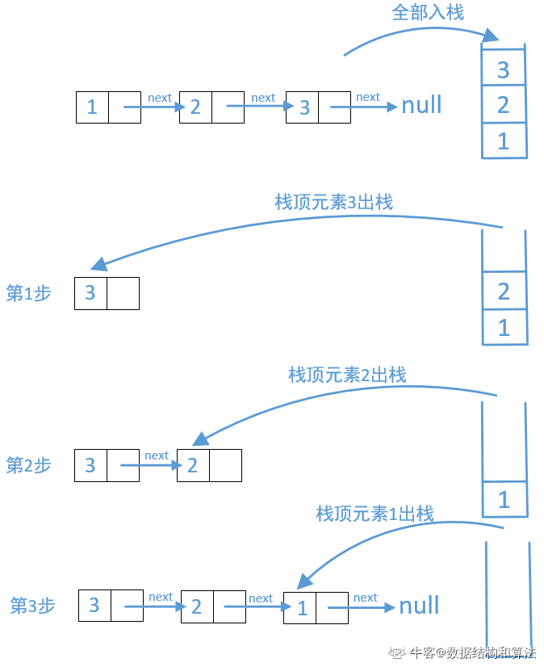
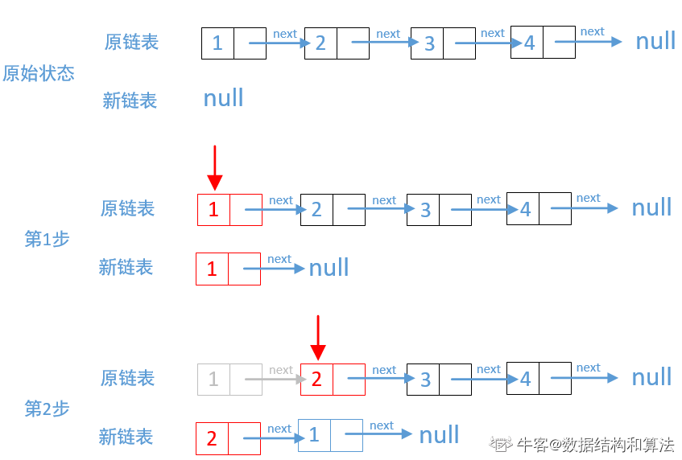

#1，反转链表
##1.1 使用栈

```java
import java.util.Stack;
public class Solution {
public ListNode ReverseList(ListNode head) {
    Stack<ListNode> stack= new Stack<>();
    //把链表节点全部摘掉放到栈中
    while (head != null) {
        stack.push(head);
        head = head.next;
    }
    if (stack.isEmpty())
        return null;
    ListNode node = stack.pop();
    ListNode dummy = node;
    //栈中的结点全部出栈，然后重新连成一个新的链表
    while (!stack.isEmpty()) {
        ListNode tempNode = stack.pop();
        node.next = tempNode;
        node = node.next;
    }
    //最后一个结点就是反转前的头结点，一定要让他的next
    //等于空，否则会构成环
    node.next = null;
    return dummy;
}
}
```
##1.2 使用双链表

```java
public ListNode ReverseList(ListNode head) {
    //新链表
    ListNode newHead = null;
    while (head != null) {
        //先保存访问的节点的下一个节点，保存起来
        //留着下一步访问的
        ListNode temp = head.next;
        //每次访问的原链表节点都会成为新链表的头结点，
        //其实就是把新链表挂到访问的原链表节点的
        //后面就行了
        head.next = newHead;
        //更新新链表
        newHead = head;
        //重新赋值，继续访问
        head = temp;
    }
    //返回新链表
    return newHead;
}
```
## 1.3 使用递归
```java
public ListNode ReverseList(ListNode head) {
    return reverseListInt(head, null);
}

private ListNode reverseListInt(ListNode head, ListNode newHead) {
    if (head == null)
        return newHead;
    ListNode next = head.next;
    head.next = newHead;
    ListNode node =  (next, head);
    return node;
}
```