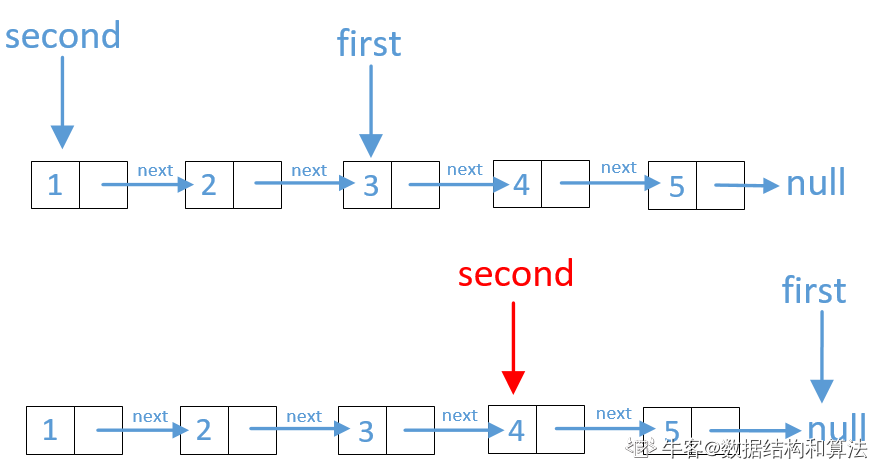

1，双指针求解
 
```java
    public ListNode FindKthToTail(ListNode pHead, int k) {
        if (pHead == null)
            return pHead;
        ListNode first = pHead;
        ListNode second = pHead;
        //第一个指针先走k步
        while (k-- > 0) {
            if (first == null)
                return null;
            first = first.next;
        }
        //然后两个指针在同时前进
        while (first != null) {
            first = first.next;
            second = second.next;
        }
        return second;
    }
```

2，使用栈解决
```java
    public ListNode FindKthToTail(ListNode pHead, int k) {
        Stack<ListNode> stack = new Stack<>();
        //链表节点压栈
        int count = 0;
        while (pHead != null) {
            stack.push(pHead);
            pHead = pHead.next;
            count++;
        }
        if (count < k || k == 0)
            return null;
        //在出栈串成新的链表
        ListNode firstNode = stack.pop();
        while (--k > 0) {
            ListNode temp = stack.pop();
            temp.next = firstNode;
            firstNode = temp;
        }
        return firstNode;
    }
```

3.使用递归
```java
    //全局变量，记录递归往回走的时候访问的结点数量
    int size;

    public ListNode FindKthToTail(ListNode pHead, int k) {
        //边界条件判断
        if (pHead == null)
            return pHead;
        ListNode node = FindKthToTail(pHead.next, k);
        ++size;
        //从后面数结点数小于k，返回空
        if (size < k) {
            return null;
        } else if (size == k) {
            //从后面数访问结点等于k，直接返回传递的结点k即可
            return pHead;
        } else {
            //从后面数访问的结点大于k，说明我们已经找到了，
            //直接返回node即可
            return node;
        }
    }
```