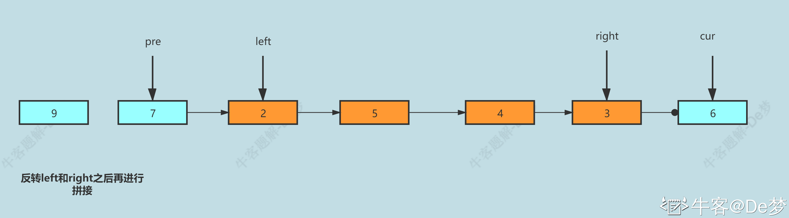
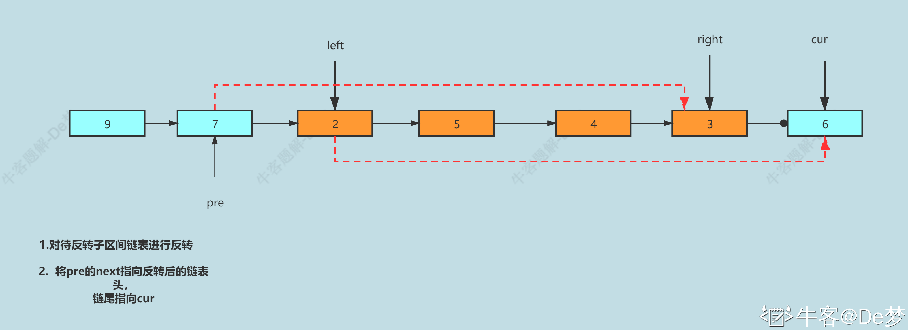
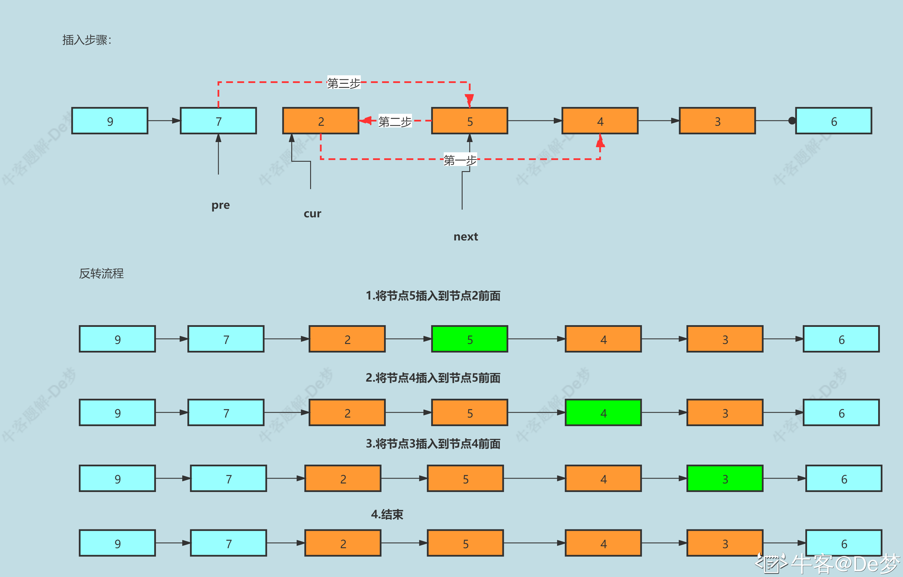

#1 链表内指定区间反转
描述
将一个节点数为 size 链表 m 位置到 n 位置之间的区间反转，要求时间复杂度 O(n)O(n)，空间复杂度 O(1)O(1)。
例如：
给出的链表为 1\to 2 \to 3 \to 4 \to 5 \to NULL1→2→3→4→5→NULL, m=2,n=4m=2,n=4,
返回 1\to 4\to 3\to 2\to 5\to NULL1→4→3→2→5→NULL.

数据范围： 链表长度 0 < size \le 10000<size≤1000，0 < m \le n \le size0<m≤n≤size，链表中每个节点的值满足 |val| \le 1000∣val∣≤1000
要求：时间复杂度 O(n)O(n) ，空间复杂度 O(n)O(n)
进阶：时间复杂度 O(n)O(n)，空间复杂度 O(1)O(1)
示例1
输入：
{1,2,3,4,5},2,4
复制
返回值：
{1,4,3,2,5}
复制
示例2
输入：
{5},1,1
复制
返回值：
{5}
复制
#1.1 双指针(两次遍历)


```java
import java.util.*;

/*
 * public class ListNode {
 *   int val;
 *   ListNode next = null;
 * }
 */

public class Solution {
    /**
     * 
     * @param head ListNode类 
     * @param m int整型 
     * @param n int整型 
     * @return ListNode类
     */
       // 解法一：双指针(两次遍历)
       //说明：方便理解，以下注释中将用left，right分别代替m,n节点 

    public ListNode reverseBetween (ListNode head, int m, int n) {
             //设置虚拟头节点
        ListNode dummyNode = new ListNode(-1);
        dummyNode.next = head;

        ListNode pre = dummyNode;
        //1.走left-1步到left的前一个节点
        for(int i=0;i<m-1;i++){
            pre = pre.next;
        }

        //2.走roght-left+1步到right节点
        ListNode rigthNode = pre;
        for(int i=0;i<n-m+1;i++){
            rigthNode = rigthNode.next;
        }

        //3.截取出一个子链表
        ListNode leftNode = pre.next;
        ListNode cur = rigthNode.next;

        //4.切断链接
        pre.next=null;
        rigthNode.next=null;

        //5.反转局部链表
        reverseLinkedList(leftNode);

        //6.接回原来的链表
        pre.next = rigthNode;
        leftNode.next = cur;
        return dummyNode.next;
    }
    //反转局部链表
    private void reverseLinkedList(ListNode head){
        ListNode pre = null;
        ListNode cur = head;
        while(cur!=null){
            //Cur_next 指向cur节点的下一个节点
            ListNode Cur_next = cur.next;
            cur.next = pre;
            pre = cur;
            cur = Cur_next ;
        }
    }
}

```
##1.2 一次遍历（对解法一的优化）
解法一一个明显不足在于，当所给子区间[m,n]范围过大，恰好等于链表头尾节点是，遍历成本变大。
解法二的思路在于，固定子区间外的节点。
在需要反转的区间里，每遍历到一个节点，让这个新节点来到反转部分的起始位置。
curr：指向待反转区域的第一个节点 left；
Cur_next：永远指向 curr 的下一个节点，循环过程中，curr 变化以后 Cur_next 会变化；
pre：永远指向待反转区域的第一个节点 left 的前一个节点，在循环过程中不变。

```java
import java.util.*;

/*
 * public class ListNode {
 *   int val;
 *   ListNode next = null;
 * }
 */

public class Solution {
    /**
     * 
     * @param head ListNode类 
     * @param m int整型 
     * @param n int整型 
     * @return ListNode类
     */
       // 
       //说明：方便理解，以下注释中将用left，right分别代替m,n节点 

    public ListNode reverseBetween (ListNode head, int m, int n) {
             //设置虚拟头节点
        ListNode dummyNode = new ListNode(-1);
        dummyNode.next =head;
        ListNode pre = dummyNode;
        for(int i=0;i<m-1;i++){
            pre = pre.next;
        }

        ListNode cur = pre.next;
        ListNode Cur_next ;
        for(int i=0;i<n-m;i++){
            Cur_next = cur.next;
            cur.next = Cur_next.next;
            Cur_next .next = pre.next;
            pre.next = Cur_next ;
        }
        return dummyNode.next;
    }
}
```
时间复杂度：O(N) 其中 N是链表总节点数。最多只遍历了链表一次，就完成了反转
空间复杂度O(1) 仅使用到常数个变量
